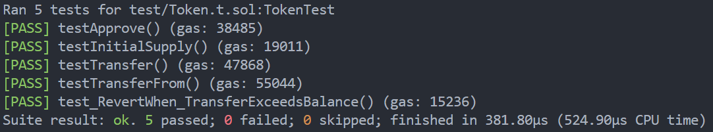
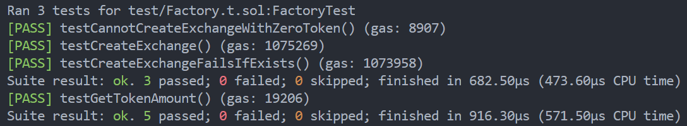
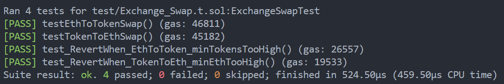
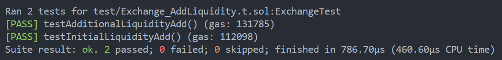
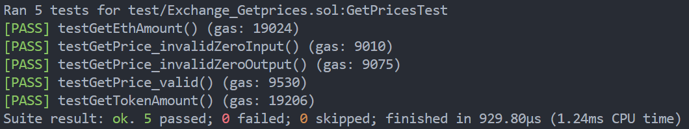
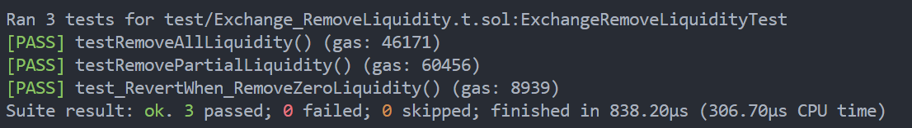

# 合约测试报告

## 1.概述：

本项目实现了Uniswap V1的核心功能，包括：

- ERC20代币合约（Token.sol）

- 去中心化交易所合约（Exchange.sol）

- 工厂合约（Factory.sol）

1.2 技术栈

- 开发框架: Foundry

- 编程语言: Solidity

- 测试框架: Forge Standard Library

- 依赖库: OpenZeppelin Contracts

1.3 测试环境

- 使用Foundry的虚拟机和测试工具

- 模拟真实以太坊网络环境

- 支持快速部署和状态重置

## 2. 测试环境

- Solidity 版本：0.8.x

- 测试框架：Foundry（forge）

- 依赖库：lib/forge-std/src/Test.sol

## 3.测试用例执行情况

### **Token 合约**

用例描述：

setup 初始化{

// 状态变量声明
Token public token;        // 公开的ERC20代币合约实例，用于测试
address public owner;      // 公开的合约拥有者地址
address public recipient = address(0xBEEF);  // 公开的接收者地址，设置为测试地址0xBEEF
uint256 public initialSupply = 1000 * 1e18;  // 公开的初始代币供应量：1000个代币（含18位小数）

// 初始化设置
owner = address(this);     // 将合约拥有者设置为当前合约地址

// 部署代币合约
// 创建新的代币合约实例：
// - 代币名称："Test Token"
// - 代币符号："TT"
// - 初始供应量：1000个代币（含18位小数）
token = new Token("Test Token", "TT", initialSupply);

}

#### 1.代币授权功能测试

测试名称：代币授权功能测试

输入参数：
    approvalAmount: 200 * 1e18  // 授权200个代币（含18位小数）

测试步骤：
1. 设置授权金额为200个代币
2. 调用token.approve执行授权操作
   - 授权recipient使用owner的代币
   - 授权金额：200个代币

验证条件：
1. 授权额度正确设置
   验证：token.allowance(owner, recipient) == approvalAmount
   错误提示："Allowance was not set correctly"

#### 2.代币初始状态验证测试

验证条件：
1. 总供应量验证
   验证：token.totalSupply() == initialSupply
   错误提示："Total supply must equal initial supply"

2. 拥有者余额验证
   验证：token.balanceOf(owner) == initialSupply
   错误提示："Owner balance must equal initial supply"

#### 3.代币转账功能测试

输入参数：
    transferAmount: 100 * 1e18  // 转账100个代币（含18位小数）

测试步骤：
1. 设置转账金额为100个代币
2. 调用token.transfer执行转账操作
   - 从owner账户转账到recipient账户
   - 转账金额：100个代币

验证条件：
1. 发送方余额正确减少
   验证：token.balanceOf(owner) == initialSupply - transferAmount
   错误提示："Owner balance did not decrease correctly"

2. 接收方余额正确增加
   验证：token.balanceOf(recipient) == transferAmount
   错误提示："Recipient balance did not increase correctly"

#### 4.代币授权转账功能测试

输入参数：
    approvalAmount: 300 * 1e18  // 授权300个代币（含18位小数）

测试步骤：
1. 设置授权金额为300个代币
2. 调用token.approve执行授权操作
3. 模拟recipient执行transferFrom操作
   - 使用vm.prank(recipient)模拟recipient调用
   - 从owner账户转账到recipient账户
   - 转账金额：300个代币

验证条件：
1. 发送方余额正确减少
   验证：token.balanceOf(owner) == initialSupply - approvalAmount
   错误提示："Owner balance did not decrease correctly"

2. 接收方余额正确增加
   验证：token.balanceOf(recipient) == approvalAmount
   错误提示："Recipient balance did not increase correctly"

#### 5.代币转账余额不足失败测试

输入参数：
    excessiveAmount: initialSupply + 1  // 尝试转账数量超过总供应量1个代币

测试步骤：
1. 设置转账金额为总供应量+1（超出可用余额）
2. 设置期望交易失败的条件
3. 尝试执行转账操作

期望结果：
- 交易应该失败回滚
- 由于余额不足导致交易失败

测试目的：
验证当用户尝试转账超过其持有余额的代币时，合约会正确拒绝该操作

测试结果

### **Factory 合约**

初始化 setup{

  Factory public factory;

  Token public token;

  address public owner = address(this);

  uint256 public initialTokenSupply = 10000 * 1e18;

​    token = new **Token**("Test Token", "TT", initialTokenSupply);

​    factory = new **Factory**();

}

用例描述：

#### 1.如果不传如token地址，则回滚

调用createExchage函数，传入0地址

回滚

结果：成功回滚

#### 2.创建交易所

传入TT token的地址，并创建交易所，

调用getExchage函数 检查返回的地址是否和创建的地址相同

结果：相同

#### 3.当exchange合约已经存在，则回滚

连续调用两次createExchange ，传入一样的Token地址

回滚

结果：成功回滚

测试结果

### **Exchange 合约**

用例描述

setup初始化{

  // 状态变量声明
Token   internal token;    // 内部ERC20代币合约实例
Exchange internal exchange;    // 内部交易所合约实例
address  internal owner = address(this);    // 合约拥有者地址，设置为当前合约地址

// 常量定义
uint256 internal constant INITIAL_TOKEN_SUPPLY   = 10_000 * 1e18;    // 初始代币总供应量：10,000个代币（含18位小数）
uint256 internal constant INITIAL_TOKEN_LIQUIDITY = 500  * 1e18;     // 初始代币流动性：500个代币（含18位小数）
uint256 internal constant INITIAL_ETH_LIQUIDITY  = 1 ether;         // 初始ETH流动性：1 ETH

// 部署和初始化流动性池
// 部署ERC20代币合约
token = new Token("Test Token", "TT", INITIAL_TOKEN_SUPPLY);    // 部署测试代币，名称为"Test Token"，符号为"TT"，初始供应量为10,000

// 部署交易所合约
exchange = new Exchange(address(token));    // 部署交易所合约，传入代币地址作为参数

// 授权交易所合约使用代币
// 将交易所合约的授权额度设置为最大值，允许交易所合约操作本合约的所有代币
token.approve(address(exchange), type(uint256).max);

// 添加初始流动性
// 调用addLiquidity函数，同时发送1 ETH，并存入500个代币作为初始流动性
// {value: INITIAL_ETH_LIQUIDITY} 表示随函数调用发送的ETH数量
exchange.addLiquidity{value: INITIAL_ETH_LIQUIDITY}(INITIAL_TOKEN_LIQUIDITY);

}

#### 1.ETH 与 Token 兑换

测试步骤：
1. 输入参数设置：
   - 设定要交换的代币数量为10个（包含18位小数：10 * 10^18）

2. 预期输出计算：
   - 调用_quoteOut函数计算预期可获得的ETH数量
   - 获取两个值：expectedEth（预期ETH数量）和minEth（最小可接受的ETH数量）

3. 记录初始状态：
   - 记录owner账户当前的ETH余额

4. 执行交换操作：
   - 调用exchange合约的tokenToEthSwap函数
   - 传入参数：代币数量(tokensIn)和最小接收ETH数量(minEth)

5. 计算实际收益：
   - 计算交换后owner账户ETH余额的增加量

6. 验证结果：
   - 确保获得的ETH数量不小于最小可接受数量（gained >= minEth）
   - 确保获得的ETH数量等于预期计算值（gained == expectedEth）

#### 2.Token 与 Token 兑换

测试步骤：
1. 调用_quoteOut获取预期兑换比率
2. 记录当前ETH余额
3. 执行代币到ETH的兑换操作
4. 计算实际获得的ETH数量

验证条件：
1. 获得的ETH >= 最小可接受数量
2. 获得的ETH == 预期计算数量

#### 3.当最小收到的Token过高时，回滚

输入参数：
    ethIn: 0.05 ether     // 输入0.05个ETH
    minTokens: 预期代币数量 + 1  // 设置一个无法达到的最小代币数量

测试步骤：
1. 调用getTokenAmount计算0.05 ETH可兑换的代币数量
2. 将最小接收代币数量设置为 计算结果 + 1（故意设置一个无法达到的值）
3. 尝试执行ETH到代币的兑换操作

期望结果：
- 交易应该失败回滚
- 错误信息："insufficient output amount"（输出数量不足）

结果：回滚并报错

#### 4.当最小收到的ETH过高时，回滚

输入参数：
    tokensIn: 5 * 1e18    // 输入5个代币（含18位小数）
    minEth: 预期ETH数量 + 1   // 设置一个无法达到的最小ETH数量

测试步骤：
1. 调用getEthAmount计算5个代币可兑换的ETH数量
2. 将最小接收ETH数量设置为 计算结果 + 1（故意设置一个无法达到的值）
3. 尝试执行代币到ETH的兑换操作

期望结果：
- 交易应该失败回滚
- 错误信息："insufficient output amount"（输出数量不足）

结果：回滚并报错

测试结果

用例描述

初始化setup{

// 状态变量声明

Token public token;     // 公开的ERC20代币合约实例，用于创建和管理代币

Exchange public exchange;  // 公开的交易所合约实例，用于处理代币交换

address public owner = address(this);  // 合约拥有者地址，设置为当前合约地址

// 初始代币供应量设置

uint256 public initialTokenSupply = 10000 * 1e18;  // 设置初始代币供应量为10000个（含18位小数）

// 部署合约

// 部署代币合约：创建一个新的代币，名称为"Test Token"，符号为"TT"，初始供应量为10000

token = new **Token**("Test Token", "TT", initialTokenSupply);

// 部署交易所合约：创建一个新的交易所，并将代币地址作为参数传入

exchange = new **Exchange**(address(token));

// 授权设置

// 授权交易所合约可以使用流动性提供者（当前合约）的代币

// 授权金额设置为初始代币供应量，允许交易所合约管理所有代币

token.**approve**(address(exchange), initialTokenSupply);

}

#### 1.添加流动性

初始状态验证：
    reserveBefore: 0  // 验证初始代币储备金为零
    错误提示："Initial reserve must be zero"

输入参数：
    tokenAmount: 500 * 1e18  // 添加500个代币（含18位小数）
    ethAmount: 1 ether      // 添加1个ETH

测试步骤：
1. 检查初始代币储备金是否为0
2. 调用addLiquidity函数添加流动性
   - 发送1 ETH
   - 存入500个代币
3. 获取铸造的流动性代币数量(liquidityMinted)
4. 检查交易所合约中的代币储备金

验证条件：
1. 首次添加流动性时，铸造的流动性代币数量应等于提供的ETH数量
   错误提示："Liquidity minted should equal msg.value"

2. 添加流动性后，交易所的代币储备金应等于提供的代币数量
   错误提示："Token reserve should match the provided token amount"

结果：通过

#### 2.初次添加流动性

初始设置：
    initialTokenAmount: 500 * 1e18  // 初始添加500个代币
    initialEthAmount: 1 ether      // 初始添加1个ETH
    
初始状态记录：
    tokenReserveBefore: 当前代币储备金
    ethReserveBefore: 当前ETH储备金（交易所合约的ETH余额）

输入参数：
    additionalEth: 0.5 ether  // 追加0.5个ETH
    expectedTokenAmount: 根据价格比例计算需要追加的代币数量
    计算公式：additionalEth * tokenReserveBefore / ethReserveBefore

测试步骤：
1. 先添加初始流动性
2. 记录添加前的储备金状态
3. 计算需要追加的代币数量
4. 调用addLiquidity追加流动性
5. 计算预期获得的流动性代币数量
6. 验证实际铸造的流动性代币数量
7. 验证代币储备金的增加量

验证条件：
1. 铸造的流动性代币数量应符合预期
   预期计算公式：(初始ETH数量 * 追加ETH数量) / 原ETH储备金
   错误提示："Additional liquidity minted mismatch"

2. 代币储备金增加量应等于计算出的期望代币数量
   错误提示："Token reserve should increase by the expected token amount"

结果：通过

测试结果

用例描述

初始化setup{

// 状态变量声明
Token public token;        // 公开的ERC20代币合约实例
Exchange public exchange;  // 公开的交易所合约实例
address public owner = address(this);  // 公开的合约拥有者地址，设置为当前合约

// 流动性参数设置
uint256 public initialTokenAmount = 500 * 1e18;   // 初始代币流动性：500个代币（含18位小数）
uint256 public initialEthAmount = 1 ether;        // 初始ETH流动性：1 ETH
uint256 public initialTokenSupply = 10000 * 1e18; // 初始代币总供应量：10000个代币（含18位小数）

// 合约部署
// 部署代币合约：创建名为"Test Token"，符号为"TT"的代币
token = new Token("Test Token", "TT", initialTokenSupply);

// 部署交易所合约：创建交易所实例，并传入代币地址
exchange = new Exchange(address(token));

// 授权设置
// 授权交易所合约使用代币，用于添加流动性
// 授权金额设置为初始代币供应量，允许交易所管理所有代币
token.approve(address(exchange), initialTokenSupply);

// 添加初始流动性
// 首次添加流动性时，提供的代币数量会被直接接受
// {value: initialEthAmount} 发送1 ETH
// 同时存入500个代币作为初始流动性
exchange.addLiquidity{value: initialEthAmount}(initialTokenAmount);

}

#### 1.代币换ETH数量计算测试

测试名称：代币换ETH数量计算测试

输入参数：
    tokensSold: 10 * 1e18  // 要出售的代币数量：10个代币

当前状态获取：
    tokenReserve: exchange.getReserve()           // 获取当前代币储备量
    ethReserve: address(exchange).balance        // 获取当前ETH储备量（应等于初始ETH数量）

预期计算：
    expectedEth: calcOutput(tokensSold, tokenReserve, ethReserve)
    使用calcOutput函数计算预期获得的ETH数量

测试步骤：
1. 获取交易所当前的代币和ETH储备量
2. 设置要出售的代币数量为10个（选择小于代币储备量的值）
3. 使用calcOutput函数计算预期获得的ETH数量
4. 调用exchange.getEthAmount获取实际计算的ETH数量
5. 比较预期和实际结果

验证条件：
1. ETH输出数量计算正确
   验证：ethOut == expectedEth
   错误提示："ETH amount output mismatch"

#### 2.价格计算零储备失败测试

测试名称：价格计算零储备失败测试

输入参数：
    输入储备量：0              // 输入代币储备量为0
    输出储备量：100 * 1e18     // 输出代币储备量：100个代币

测试步骤：
1. 设置输入储备量为0（无效值）
2. 设置期望交易失败的条件
3. 尝试调用getPrice计算价格

期望结果：
- 交易应该失败回滚
- 错误信息："invalid reserves"（无效储备量）

测试目的：
验证当输入储备量为0时，价格计算函数会正确拒绝该操作

#### 3.价格计算零输出储备失败测试

测试名称：价格计算零输出储备失败测试

输入参数：
    输入储备量：100 * 1e18    // 输入代币储备量：100个代币
    输出储备量：0              // 输出代币储备量为0

测试步骤：
1. 设置输出储备量为0（无效值）
2. 设置期望交易失败的条件
3. 尝试调用getPrice计算价格

期望结果：
- 交易应该失败回滚
- 错误信息："invalid reserves"（无效储备量）

测试目的：
验证当输出储备量为0时，价格计算函数会正确拒绝该操作

#### 4.价格计算功能测试

输入参数：
    inputReserve: 200 * 1e18   // 输入代币储备量：200个代币
    outputReserve: 100 * 1e18  // 输出代币储备量：100个代币

预期计算：
    expectedPrice: (inputReserve * 1000) / outputReserve
    计算结果：(200 * 1000) / 100 = 2000

测试步骤：
1. 设置输入和输出代币的储备量
2. 计算预期价格比率（放大1000倍）
3. 调用exchange.getPrice获取实际计算的价格
4. 比较预期价格和实际价格

验证条件：
1. 价格计算正确
   验证：price == expectedPrice
   错误提示："Price calculation mismatch"

#### 5.ETH换代币数量计算测试

测试名称：ETH换代币数量计算测试

输入参数：
    ethSold: 0.1 ether  // 要出售的ETH数量：0.1 ETH

当前状态获取：
    tokenReserve: exchange.getReserve()           // 获取当前代币储备量
    ethReserve: address(exchange).balance        // 获取当前ETH储备量（应等于初始ETH数量）

预期计算：
    expectedTokens: calcOutput(ethSold, ethReserve, tokenReserve)
    使用calcOutput函数计算预期获得的代币数量

测试步骤：
1. 获取交易所当前的代币和ETH储备量
2. 设置要出售的ETH数量为0.1 ETH
3. 使用calcOutput函数计算预期获得的代币数量
4. 调用exchange.getTokenAmount获取实际计算的代币数量
5. 比较预期和实际结果

验证条件：
1. 代币输出数量计算正确
   验证：tokensOut == expectedTokens
   错误提示："Token amount output mismatch"

测试结果

用例描述

初始化setup{

 // 状态变量声明
Token   internal token;    // 内部ERC20代币合约实例，用于测试
Exchange internal exchange;    // 内部交易所合约实例，用于测试
address  internal owner = address(this);    // 合约拥有者地址，设置为当前合约地址

// 常量定义 - 使用scientific notation(科学计数法)表示
uint256 internal constant INIT_TOKEN_SUPPLY   = 10_000e18;    // 初始代币总供应量：10,000个代币（含18位小数）
uint256 internal constant INIT_TOKEN_LIQUIDITY = 500e18;      // 初始代币流动性：500个代币（含18位小数）
uint256 internal constant INIT_ETH_LIQUIDITY  = 1 ether;      // 初始ETH流动性：1 ETH

// 合约部署和初始化
// 部署代币合约：创建名为"Test Token"，符号为"TT"的代币，初始供应量为10,000个
token = new Token("Test Token", "TT", INIT_TOKEN_SUPPLY);

// 部署交易所合约：创建交易所实例，并传入代币地址
exchange = new Exchange(address(token));

// 授权设置：允许交易所合约使用本合约的代币
// type(uint256).max 表示授权最大数量，即无限授权
token.approve(address(exchange), type(uint256).max);

// 添加初始流动性：
// {value: INIT_ETH_LIQUIDITY} 发送1 ETH
// 同时存入500个代币作为初始流动性
exchange.addLiquidity{value: INIT_ETH_LIQUIDITY}(INIT_TOKEN_LIQUIDITY);

}

#### 1.移除流动性

初始状态记录：
    lpBalance: exchange.totalSupply()    // 获取当前流动性代币总量（等于初始添加的ETH数量：1e18）
    ethBefore: owner当前ETH余额         // 记录移除前的ETH余额
    tokBefore: owner当前代币余额        // 记录移除前的代币余额

测试步骤：
1. 获取当前所有流动性代币数量
2. 记录移除前的ETH和代币余额
3. 调用removeLiquidity移除所有流动性
4. 获取返回的ETH数量(ethOut)和代币数量(tokOut)

验证条件：
1. ETH正确返还
   验证：owner.balance == ethBefore + ethOut
   错误提示："ETH not received"

2. 代币正确返还
   验证：token.balanceOf(owner) == tokBefore + tokOut
   错误提示："Token not received"

3. 流动性代币全部销毁
   验证：exchange.totalSupply() == 0
   错误提示："LP supply not burned"

#### 2.移除部分流动性

初始状态记录：
    lpTotal: 当前流动性代币总量
    lpRemove: 要移除的流动性代币数量（总量的一半）
    ethBefore: owner当前ETH余额
    tokBefore: owner当前代币余额

输入参数：
    lpRemove: lpTotal / 2  // 移除一半的流动性代币

测试步骤：
1. 获取当前总流动性代币数量
2. 计算要移除的流动性代币数量（一半）
3. 记录移除前的ETH和代币余额
4. 调用removeLiquidity移除部分流动性
5. 获取返回的ETH数量(ethOut)和代币数量(tokOut)

验证条件：
1. ETH正确返还
   验证：owner.balance == ethBefore + ethOut
   错误提示："ETH not received"

2. 代币正确返还
   验证：token.balanceOf(owner) == tokBefore + tokOut
   错误提示："Token not received"

3. 流动性代币正确销毁
   验证：exchange.totalSupply() == lpTotal - lpRemove
   错误提示："LP supply wrong after burn"

#### 3.验证当用户尝试移除0个流动性代币时，合约会正确拒绝该操作

输入参数：
    移除数量：0  // 尝试移除0个流动性代币

测试步骤：
1. 设置期望交易失败的条件
2. 调用removeLiquidity尝试移除0个流动性代币

期望结果：
- 交易应该失败回滚
- 错误信息："invalid amount"（无效数量）

测试结果：

## 4.测试结果分析

测试覆盖率

| File             | Lines          | Statements     | Branches       | Funcs          |
| :--------------- | :------------- | :------------- | :------------- | :------------- |
| src/Exchange.sol | 87.18% (68/78) | 87.91% (80/91) | 68.18% (15/22) | 84.62% (11/13) |
| src/Factory.sol  | 100.00% (9/9)  | 100.00% (8/8)  | 100.00% (4/4)  | 100.00% (2/2)  |
| src/Token.sol    | 100.00% (2/2)  | 100.00% (1/1)  | 100.00% (0/0)  | 100.00% (1/1)  |

测试通过率：100%
