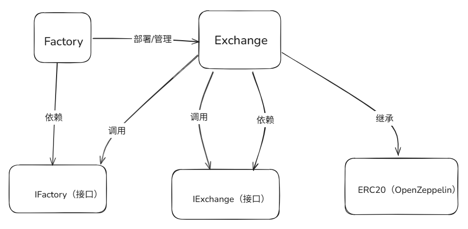

# 智能合约开发文档

## 一、文档概述

### 1.文档说明

本说明文档旨在为开发者和用户提供 Uniswap V1 智能合约的详细开发参考与使用指南。

内容涵盖合约架构、接口说明流程及常见问题，帮助开发者快速理解合约实现原理，便于二次开发、测试和集成，也为用户提供合约交互和风险防范的操作指引。

本手册适用于：

- 智能合约开发者
- 有意参与co-learning共学的开发者

### 2.目的与范围

项目实现了一个简化版的 Uniswap V1 去中心化交易所（DEX），支持 ERC20 代币与 ETH 的自动做市、流动性管理和兑换功能。适用于学习、测试和小型 DEX 场景。

## 二、合约架构设计

1.整体架构图

- 用图表展示合约间的继承关系、接口调用逻辑（如主合约→库合约→接口合约）。
- images/合约继承关系.png



    User -- "交互/添加流动性/兑换" --> Exchange
    Factory -- "部署/管理" --> Exchange
    Exchange -- "调用" --> IFactory
    Exchange -- "调用" --> IExchange
    Factory -- "依赖" --> IFactory
    Exchange -- "依赖" --> IExchange
    Exchange -- "继承" --> ERC20["ERC20 (OpenZeppelin)"]

## 三、详细设计文档

### 1.合约状态变量

**Token**

- name：代币名称

- symbol：代币符号

- totalSupply：总供应量

**Factory**

- tokenToExchange：ERC20 代币地址到 Exchange 地址的映射

**Exchange**

- tokenAddress：ERC20 代币地址

- factoryAddress：工厂合约地址

### 2.**恒定乘积公式AMM实现**

恒定乘积公式 (x * y = k) 的核心实现
$$
x' \text{ 代表存入的 ETH 数量，} \quad y' \text{ 代表换出来的 Token 数量} \\ x \text{ 资金池里有的的 ETH 数量，} \quad y \text{ 代表资金池里有的Token数量}
$$

$$
(x +  x') \times (y -  y') = k
$$

$$
y' = \frac{ x' \times y}{x +  x'}
$$

```solidity
//举例子 池子里面有 10个ETH 和 20000个USDT  想用1个ETH 换usdt出来
//入参：inputAmount = 1ETH  inputReserve = 10ETH  outputReserve = 5000USDT
//计算过程：inputAmountWithFee = 1ETH * 997
//分子：numerator = 1ETH * 997 * 20000USDT = 19940000
//分母：denominator = 10ETH * 1000 + 1ETH * 997 = 10997
//出参：outputAmount = numerator / denominator 
//计算可得 可以换出 1813.22179 usdt
function getAmount(uint256 inputAmount, uint256 inputReserve, uint256 outputReserve) private pure returns (uint256) {
    require(inputReserve > 0 && outputReserve > 0, "invalid reserves");
    uint256 inputAmountWithFee = inputAmount * 997;  // 0.3% 手续费
    uint256 numerator = inputAmountWithFee * outputReserve;
    uint256 denominator = (inputReserve * 1000) + inputAmountWithFee;
    return numerator / denominator;
}
```

代码解析

1. 参数说明：

inputAmount,   // 用户想要交换的输入代币数量

inputReserve,  // 当前输入代币的储备量

outputReserve  // 当前输出代币的储备量

2. 如果不考虑手续费代入公式

$$
换出来的代币数量 = \frac{inputAmount \times outputReserve}{inputReserve + inputAmount}
$$

3. 如果考虑手续费后的公式：

- 实际输入量 = 输入量 × (1 - 手续费率)

- 手续费率 = 0.3%

- 即：inputAmountWithFee = inputAmount * 997 / 1000

$$
换出来的代币数量 = \frac{inputAmount * 997 \times outputReserve}{inputReserve*1000+inputAmount*997}
$$


### 3.事件定义

| 事件名称        | 参数                               | 描述                |
| :-------------- | :--------------------------------- | :------------------ |
| AddLiquidity    | provider, eth_amount, token_amount | 添加流动性时触发    |
| RemoveLiquidity | provider, eth_amount, token_amount | 移除流动性时触发    |
| TokenPurchase   | buyer, eth_sold, tokens_bought     | 用ETH购买代币时触发 |
| EthPurchase     | buyer, tokens_sold, eth_bought     | 用代币购买ETH时触发 |
| Transfer        | _from，_to，_value                 | 转移ERC20代币时触发 |

### **4.函数接口**

以表格的形式呈现，具体接口参考Uniswap智能合约接口设计文档

| **函数名称**         | **描述**                     |
| -------------------- | ---------------------------- |
| **ethToTokenSwap**   | ETH 兑换代币                 |
| **tokenToEthSwap**   | 代币兑换 ETH                 |
| **tokenToTokenSwap** | 代币兑换代币                 |
| **removeLiquidity**  | 移除流动性                   |
| **addLiquidity**     | 添加流动性                   |
| **createExchange**   | 创建新的交易所               |
| **getExchange**      | 获取指定代币对应的交易所地址 |


## **四、部署与维护**

### **1.环境要求**

Solidity版本: ^0.8.0
依赖:

* OpenZeppelin Contracts (ERC20实现)

工具：

* Foundry

### **2.部署脚本**

```
forge script script/文件:合约名称 \

  --rpc-url $RPC_URL \

  --broadcast \
```

具体部署脚本参考部署文档