# Uniswap v1 智能合约架构文档

# 一、基本架构

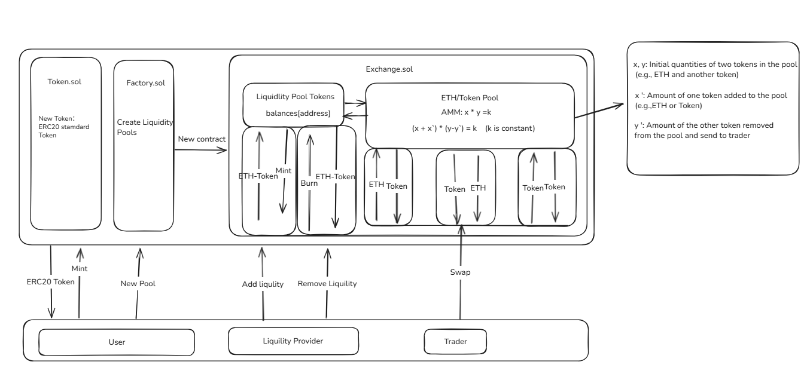

## 1、核心角色

Uniswap V1 是基于自动做市商（AMM）模型的去中心化交易协议，核心角色及交互围绕以下模块展开：

1. **交易者（Trader）**

- **交易（Swap）**：支持三种交易路径：`ETH ↔ Token`、`Token ↔ ETH`、`Token ↔ Token`，通过兑换合约（Exchange Contract）与资金池交互，实现资产兑换。

2. **流动性提供者（Liquidity Provider）**

- **添加流动性（Add Liquidity）**：向 `ETH/ERC20 Pool` 注入 ETH 和对应 ERC20 代币，为交易提供深度；作为回报，协议发行流动性池代币（Liquidity Pool Tokens），代表其在资金池中的份额。
- **移除流动性（Remove Liquidity）**：销毁持有的流动性池代币，赎回对应比例的 ETH 和 ERC20 代币；赎回时，协议会销毁相应份额的流动性池代币。

   3.**用户（User）**

- **创建代币（Mint ERC20 Token）**：依托 `Token.sol` 合约，用户可发行符合 ERC20 标准的新代币 ，将新资产引入生态，为后续构建交易对、流动性池做基础准备。
- **创建资金池（New Pool）**：借助 `Factory.sol` 合约（标注 “Create Liquidity Pools” ），发起创建新流动性池的操作，推动不同资产（如 ETH 与新发行 ERC20 代币）形成交易市场，拓展生态交易品类 。

## 2、资金池与 AMM 模型（ETH/ERC20 Pool）

1. 资金池

资金池是把一定数量的 ETH（以太坊）和 ERC20 代币（符合以太坊 ERC20 标准的代币，如 USDT、DAI 等），汇集到智能合约里形成的 “资产储备池” 。比如在 ETH/ERC20 交易场景中，它就像一个 “资产蓄水池”，里面存着两种资产，为交易、提供流动性等操作提供基础。

2. AMM 模型（自动化做市商模型 ）

**恒定乘积公式：**
$$
x \times y = k
$$

AMM 是去中心化交易中**自动定价、促成交易**的核心机制，在 ETH/ERC20 资金池里，靠**恒定乘积公式（比如x、y 是池里 ETH 和 ERC20 代币数量，k是恒定常数 ）** 运行。

**举例：池子ETH/DAI  DAI是ERC20代币(不考虑手续费)**

**流动性提供者1：**

我们利用恒定乘积公式算出k值
$$
x \times y = k
$$

$$
初次添加流动性时：获得的流动性池代币的数量 = 添加ETH的数量
$$

* **初始设置**：创建资金池时，存入一定量 ETH（*x*=10 ）和 DAI（*y*=500 ），算出 恒定乘积公式*k*=*x*⋅*y*，之后交易中 *k* 基本不变（忽略手续费等微小影响 ）。并获得协议发行流动性池代币（Liquidity Pool Tokens），这里的数量等于ETH的数量也就是获得10个流动性池代币，代表其在资金池中的份额。因为是第一次在池子中存入代币，所以占池子份额的百分百。此时一个ETH 值 50个DAI，比例1:50。

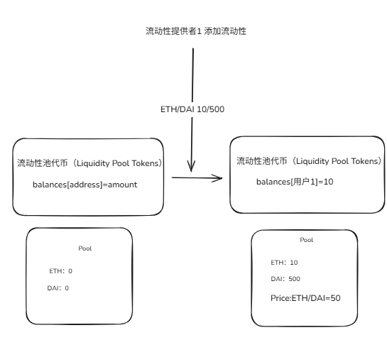

**交易者1：**

换出来Token的数量计算公式：
$$
x' \text{ 代表存入的 ETH 数量，} \quad y' \text{ 代表换出来的 Token 数量}
$$

$$
(x +  x') \times (y -  y') = k
$$

$$
y' = \frac{ x' \times y}{x +  x'}
$$

- **交易调整**：当他用 ETH 换 ERC20（DAI） 代币（比如存入 *x*′ =1数量的 ETH ），池里 ETH 数量变 *x*+*x*′ ，为保持 *k* 恒定，ERC20 代币数量就得减少 *y*′ ，变成 *y*−*y*′ ，即 (*x*+*x*′)⋅(*y*−*y*′)=*k* 。这过程中，价格自动变化 ——**ETH 存得多了**，它相对 ERC20 代币就 “贬值”，交易者换 ERC20 代币时，拿到的数量会根据公式调整，实现自动定价和交易。带入公式可以得到y'=(x' * y)/(x+x') ,最后换出来了45.454个DAI。每一笔交易都会导致价格发生变化，交易完成后现在池子里面有11个ETH，454.546个DAI，现在1个ETH价值41.32个DAI，相比没有完成这笔交易时，ETH能换的DAI变少了，反之DAI可以换ETH更多了，由此可以得之，在交易中，向池子里投入什么代币，什么代币就会贬值，反之，换出来的代币就会升值。
- 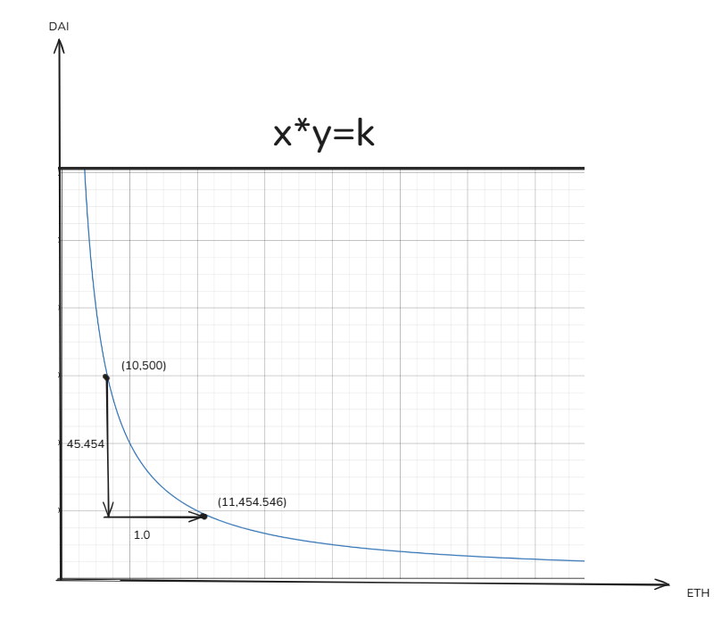

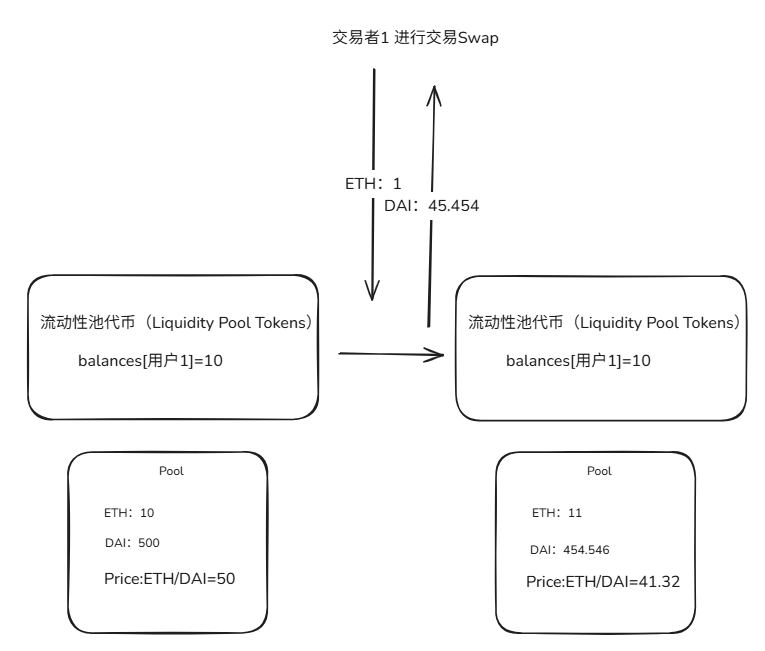

**流动性提供者2**：
$$
x' \text{ 代表存入的 ETH 数量，} \quad x \text{ 代表资金池现有的ETH数量，} \quad n\text{代表获得的流动性池代币的数量}
$$

$$
非初次添加流动性：n=\frac{x'}{x}
$$

$$
\Delta y\text{代表需要投入的Token数量} \quad \Delta x \text{ 代表投入的 ETH 数量，} \quad x \text{ 代表资金池现有的ETH数量，}\quad y \text{ 代表资金池现有的Token数量，}
$$

$$
非初次添加流动性：\Delta y = \frac{\Delta x \times y}{x}
$$

* **再次添加流动性**：还是一样的池子，现在池子里面有11个ETH，454.546个DAI，流动性池代币（Liquidity Pool Tokens）已发放10个，现在流动性提供者2也想往这个池子里面投入交易对，我们需要按比例投入代币，现在ETH：DAI = 1:41.32个,比如流动性提供者2投入1个ETH，他就必须投入41.32个DAI，这样做的目的是让池子里ETH的价值不变,增加流动性后ETH：DAI 还是 = 1:41.32 ，添加流动性后，池子里现有ETH=12个，DAI=495.866，注入流动性后会获得流动性池代币（Liquidity Pool Tokens），这是证明我们往这个池子里投入了代币，具体数量多少是根据投入的ETH数量（1个ETH）除以资金池里现在有的ETH数量（11个ETH）再乘以已经发放的总流动性池代币数量（10个Liquidity Pool Tokens），最后结果是10/11个。此时已发放总流动性池代币10.9个。

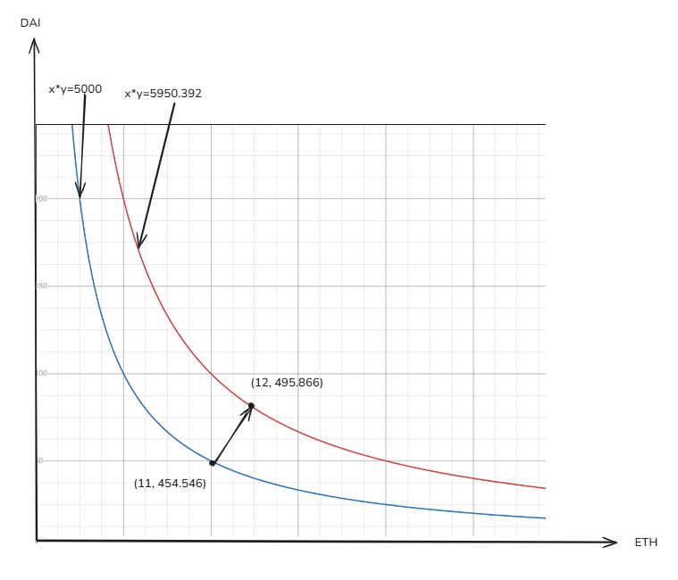

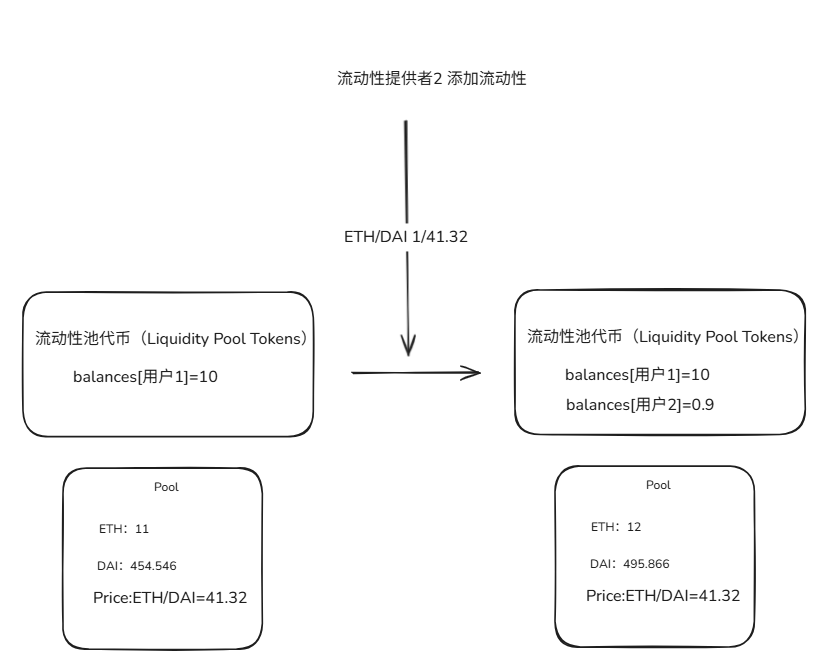

**流动性提供者1移除流动性取回在池子里的代币**
$$
\Delta x\text{代表需要取回的ETH的数量} \quad m \text{ 代表拥有流动性池代币的数量，} \\ x \text{ 代表资金池现有的ETH数量，}\quad m总 \text{ 代表已经分发的所有流动性池代币数量，}
$$

$$
\Delta x = \frac{m \times x}{m总}
$$

$$
\Delta y\text{代表需要取回的Token数量} \quad m \text{ 代表拥有流动性池代币的数量，} \\ y \text{ 代表资金池现有的Token数量，}\quad m总 \text{ 代表已经分发的所有流动性池代币数量，}
$$

$$
\Delta y = \frac{m \times y}{m总}
$$

* **移除流动性并取回代币对**：能取回多少代币是取决于拥有多少流动性池代币，流动性提供者1现在有10个流动性池代币，他现在想要取回全部的代币，能取回多少代币是根据拥有的流动性代币占总已发放的流动性代币的比例取回，比如可以取回ETH的数量等于10/10.9*池子里总ETH的数量（12个），最后可以取回的ETH数量是11.009个ETH，同理可以取回DAI的数量等于10/10.9*池子里总DAI的数量（495.866个），最后可以取回的DAI数量是454.922个，现在池子里有ETH0.991个，DAI=40.944个，同理ETH的价值是不变的,ETH：DAI 还是 = 1:41.32,并销毁10个流动性池代币

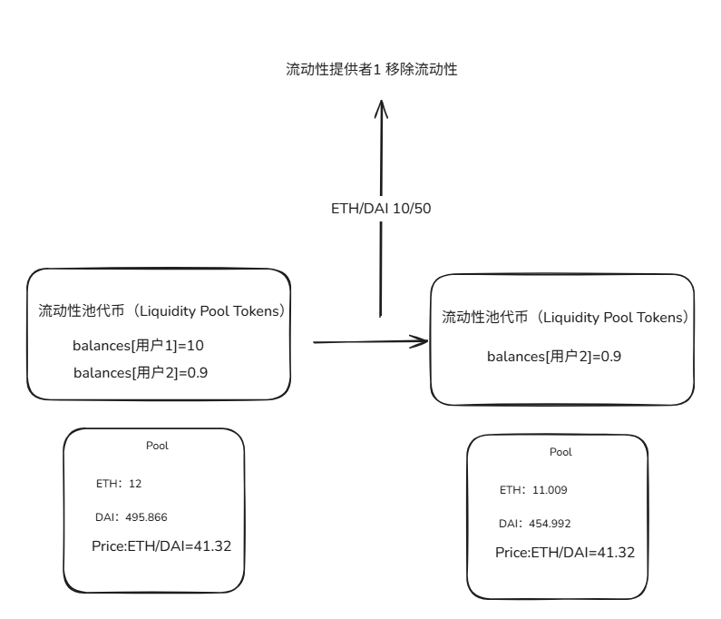

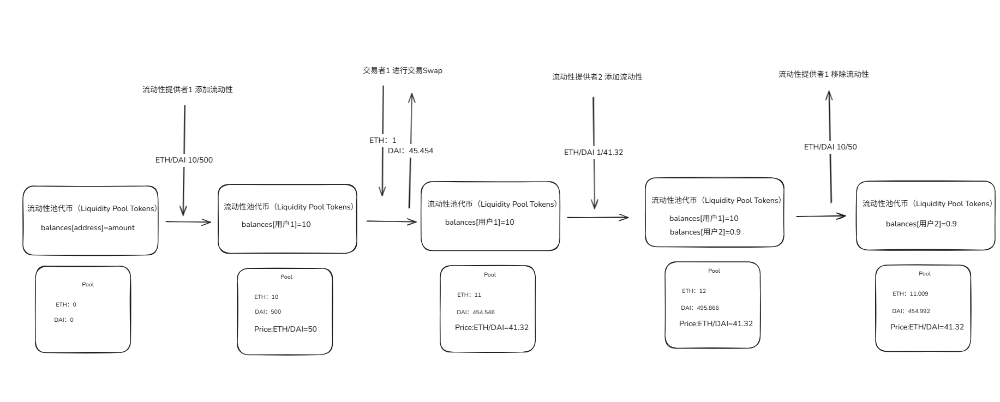

# 二、Uniswap V1 数据流图解析

## 1.**两种核心账户类型** 的结构与区别（包含数据存储的位置）

**外部拥有账户（Externally Owned Account, EOA）：由私钥（private key）控制的普通用户 / 实体账户（对应图中 `External actor` 持有的钥匙），类似传统 “银行卡账户”，但用加密私钥签名交易。**

账户状态（Account state）

- **Address（地址）**：账户的唯一标识（如 `0x123...abc` ），接收 / 发送资产的 “门牌号”。
- **nonce**：交易计数器，防止同一笔交易被重复提交（每发 1 笔交易，nonce+1 ）。
- **balance**：账户持有的 ETH 或代币余额（数字资产数量）。
- **storage hash/code hash**：均为 “灰色不可用” 状态 → **EOA 没有智能合约代码**，无法存储复杂逻辑，仅用于签名、收发资产。

- 图注：`EOA is controlled by a private key. EOA cannot contain EVM code.`
  → EOA 由私钥控制，**不能包含以太坊虚拟机（EVM）代码**，只能发起交易（如转账、调用合约），但自身无自动执行逻辑。

**合约账户（Contract account）：部署在以太坊上的智能合约账户，由 EVM 代码控制，类似 “自动执行的程序账户”，可实现复杂逻辑（如 DeFi 交易、NFT 铸造）。**

- **Address（地址）**：合约部署后生成的唯一地址（如 `0x456...def` ），与 EOA 地址格式相同，但本质是 “代码容器”。
- **nonce**：交易计数器，不过合约账户的 nonce 通常用于 “创建新合约” 时的计数（与 EOA 逻辑有差异 ）。
- **balance**：合约账户可持有 ETH 或代币（如 Uniswap 交易池合约会存用户注入的资产 ）。
- storage hash/code hash：均为 “红色激活” 状态 →合约账户包含 EVM 代码和存储：
  - `code hash`：指向智能合约的字节码（程序逻辑，如 `transfer` 函数、自动做市算法 ）。
  - `storage hash`：指向合约的存储区域（保存变量、状态，如交易池的资产数量、用户余额，如balance ）。

- 图注：`Contract contains EVM code. Contract is controlled by EVM code.`

  → 合约账户包含 EVM 代码，**由代码逻辑自动控制**，无需人工私钥签名（但触发合约需 EOA 发起交易或其他合约调用 ）。

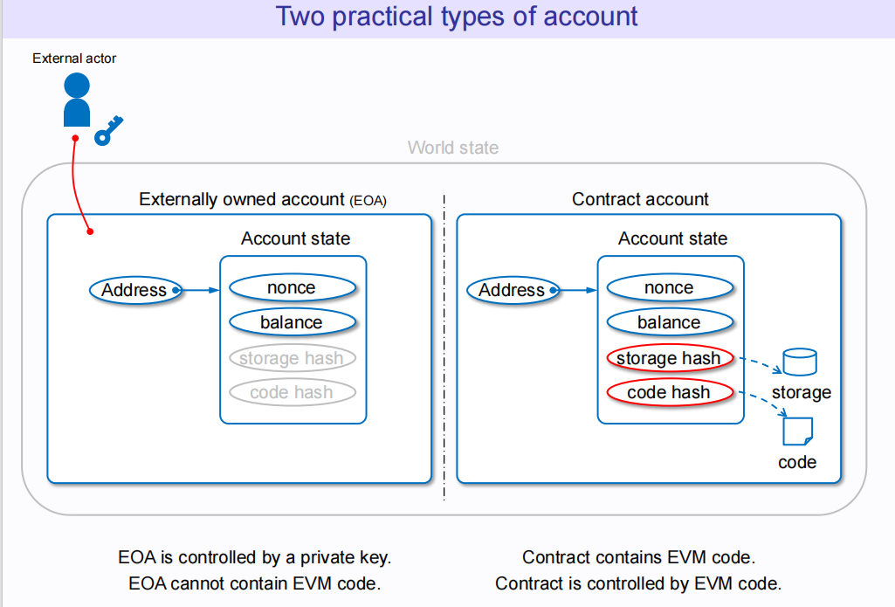

以下按层级（Level 0 → Level 1 → Level 2 ）拆解，结合 **AMM 核心逻辑（x\*y=k）** 与实际交互，说明各流程数据流转：

## 2、Level 0 Diagram

**核心作用**：呈现 Uniswap V1 最顶层交互关系，区分 **交易者（Trader）** 与 **流动性提供者（Liquidity Provider）** 两类角色，展示资产与凭证的流入流出。

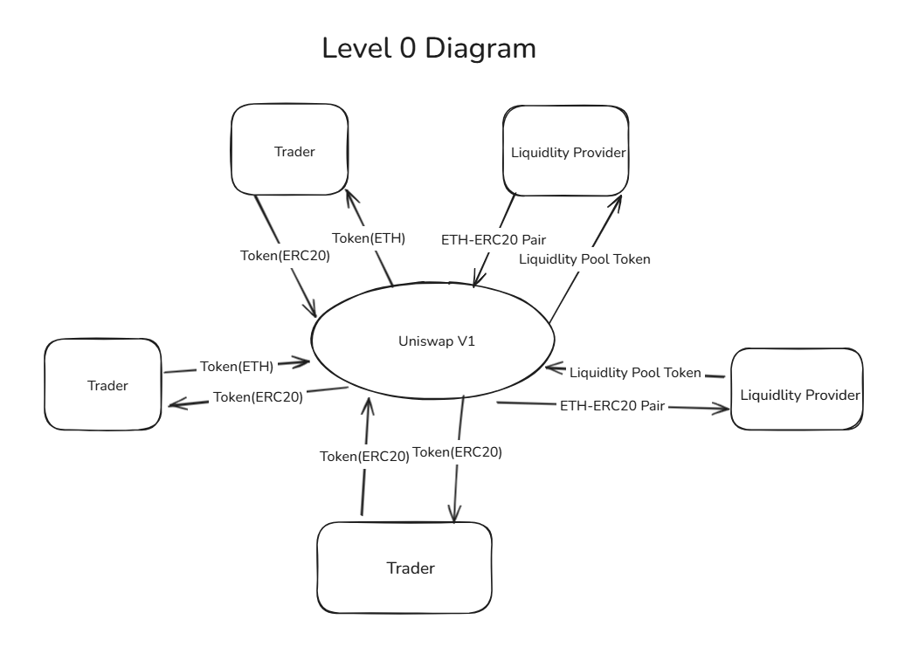

数据流转逻辑

- 交易者（Trader）：
  - 输入：`Token(ETH)` 或 `Token(ERC20)`（如用 ETH 买 ERC20 代币、用 ERC20 代币换 ETH 等 ）。
  - 输出：获得兑换后的 `Token(ERC20)` 或 `Token(ETH)`，实现资产互换。
- 流动性提供者（Liquidity Provider）：
  - 输入：`ETH-ERC20 Pair`（ETH + ERC20 代币的资产对 ）、`Liquidity Pool Token`（LP 凭证 ）。
  - 输出：添加流动性时，注入 `ETH-ERC20 Pair` 获得 `Liquidity Pool Token`；移除流动性时，销毁 `Liquidity Pool Token` 赎回 `ETH-ERC20 Pair` 。
- **核心规则**：所有交互均通过 `Uniswap V1` 协议枢纽完成，依托 **恒定乘积模型（x\*y=k）** 自动定价与撮合。

## 3、Level 1 Diagram

**核心作用**：聚焦 `x*y=k` 模型的应用场景，拆解不同资产 / 凭证与资金池的交互和数据流向。

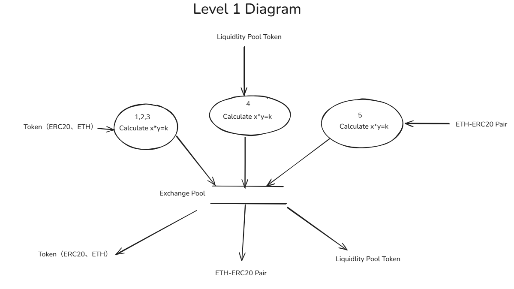

模块与数据流转

- Token（ERC20、ETH）：
  - 流程 `1,2,3`：交易者交易（如 ETH ↔ ERC20 互换 ）时，协议读取当前资金池的 `x`（ETH 储备 ）、`y`（ERC20 储备 ），执行 `Calculate x*y=k` 计算，调整储备并完成兑换。
- Liquidity Pool Token：
  - 流程 `4`：流动性提供者添加 / 移除流动性时，协议根据当前资金池 `x`、`y` 计算新的 `k`，调整资金池储备，并铸造 / 销毁 `Liquidity Pool Token` 。
- ETH-ERC20 Pair：
  - 流程 `5`：与 `Liquidity Pool Token` 逻辑协同，注入 / 赎回 `ETH-ERC20 Pair` 时，通过 `Calculate x*y=k` 确保资金池比例稳定，同步更新 LP 凭证。

## 4、Level 2 Diagram（合约存储层）

**核心作用**：深入智能合约存储结构，展示 `x*y=k` 计算与 **账户 / 合约状态** 的关联，包含两类典型流程（以两张 Level 2 图为例 ）。

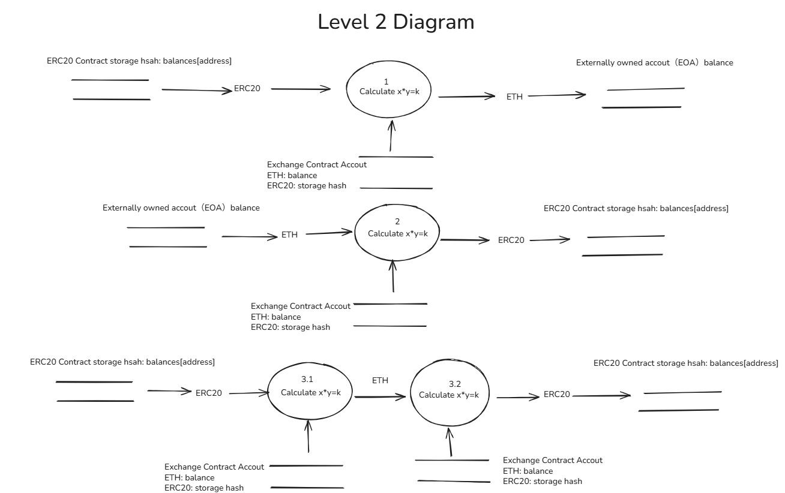

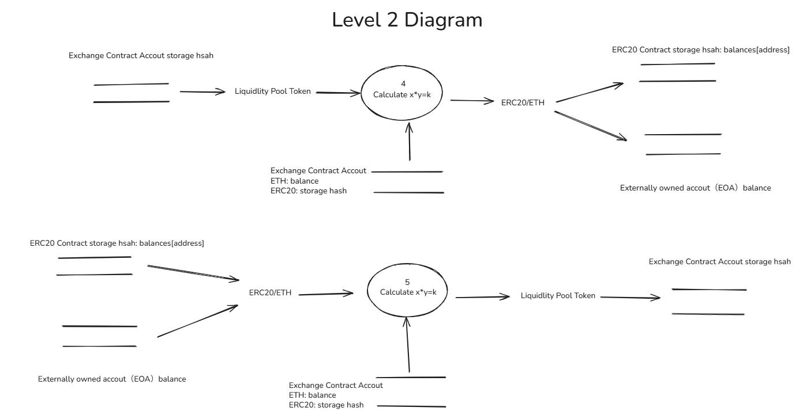

图 1：交易者交易流程（ETH ↔ ERC20 双向互换 + ERC20 ↔ ERC20 互换 ）

1. ERC20 → ETH 互换（流程 1 ）

- 数据存储位置：
  - ERC20 存储：用户持有的 ERC20 余额在 **对应 ERC20 代币合约的 storage hash（balances [address]）**；资金池 ERC20 储备在 **兑换合约账户的 ERC20 storage hash**。
  - ETH 存储：用户 ETH 余额（目标增加量 ）在 **EOA 的 balance**；资金池 ETH 储备在 **兑换合约账户的 ETH balance**。
- 交互流程：
  1. **读取数据**：协议读取 ERC20 代币合约的 storage hash（用户要花的 ERC20 余额 ）、兑换合约账户的 ERC20 storage hash（资金池 ERC20 储备  ）和 ETH balance（资金池 ETH 储备）。
  2. **执行计算**：根据 `x*y=k`，用户注入 ERC20 后，资金池 ERC20 storage hash 增加，协议计算需释放的 ETH 数量，调整兑换合约账户的 ETH balance。
  3. **更新账户**：扣减 ERC20 代币合约 storage hash 中用户地址的 balances（ERC20 减少 ），同步增加 EOA 的 ETH balance（ETH 增加 ），完成 ERC20 → ETH 兑换。

2. ETH → ERC20 互换（流程 `2`）

- 数据存储位置：
  - ETH 存储：用户 ETH 余额在 **外部拥有账户（EOA）的 balance**；资金池 ETH 储备在 **兑换合约账户（Exchange Contract Account）的 ETH balance**。
  - ERC20 存储：用户目标 ERC20 余额（初始为 0 或基础持有量 ）记录在 **对应 ERC20 代币合约的 storage hash（balances [address]）**；资金池 ERC20 储备在 **兑换合约账户的 ERC20 storage hash**。
- 交互流程：
  1. **读取数据**：协议读取 EOA 的 ETH balance（用户要花的 ETH ）、兑换合约账户的 ETH balance（资金池 ETH 储备）和 ERC20 storage hash（资金池 ERC20 储备 ）。
  2. **执行计算**：根据 `x*y=k`，用户注入 ETH 后，资金池 ETH balance 增加，协议计算需释放的 ERC20 数量，调整兑换合约账户的 ERC20 storage hash。
  3. **更新账户**：扣减 EOA 的 ETH balance（ETH 减少 ），同步在对应 ERC20 代币合约的 storage hash 中，增加用户地址的 balances（ERC20 增加 ），完成 ETH → ERC20 兑换。

3. ERC20 ↔ ERC20 互换（流程 `3.1`/`3.2` ）

- 数据存储位置：
  - 所有 ERC20 余额均在 **对应 ERC20 代币合约的 storage hash（balances [address]）**；中间媒介 ETH 储备在 **兑换合约账户的 ETH balance**；两次资金池的 ERC20 储备分别在各自 **兑换合约账户的 ERC20 storage hash** 。
- 交互流程：
  1. 第一次兑换（ERC20 → ETH ，流程 `3.1` ）：
     - 读取用户 ERC20 代币合约的 storage hash（用户要花的 ERC20 余额 ）、兑换合约账户的 ERC20 storage hash（资金池 ERC20 储备 `y1` ）和 ETH balance（资金池 ETH 储备 `x1` ）。
     - 执行 `x1*y1=k1`，调整兑换合约账户的 ERC20 storage hash 的余额balance和 ETH 的余额balance，同步扣减用户 ERC20 代币合约的 storage hash 余额balance 。
  2. 第二次兑换（ETH → 目标 ERC20 ，流程 `3.2` ）：
     - 读取兑换合约账户的 ETH balance（第一次兑换后的 ETH 储备）和目标 ERC20 资金池的 ERC20 storage hash（目标代币储备）、ETH balance（目标资金池 ETH 储备）。
     - 执行 `x2*y2=k2`，调整目标资金池的 ETH balance，和 ERC20 storage hash，同步增加用户目标 ERC20 代币合约的 storage hash 余额。
  3. **最终结果**：跨两次资金池调整，完成 ERC20 → ERC20 互换，更新用户两个 ERC20 代币合约的 storage hash 与资金池状态。

图 2：流动性操作（铸造 / 销毁 LP 代币）

- 数据存储位置：
  - 资金池状态：记录在 **兑换合约账户的 storage hash**（包含 ETH balance、ERC20 storage hash ）。
  - LP 凭证：`Liquidity Pool Token` 归属由 **兑换合约账户的 storage hash** 管理（铸造 / 销毁逻辑 ）。
  - ERC20 余额：用户 / 流动性提供者的 ERC20 余额在 **ERC20 代币合约的 storage hash（balances [address]）**；资金池 ERC20 储备在 **兑换合约账户的 ERC20 storage hash** 。
  - ETH 储备：资金池 ETH 储备在 **兑换合约账户的 ETH balance** 。
- 交互流程：
  1. 读取数据：协议从兑换合约账户读取 storage hash（资金池状态 ）、ETH balance、ERC20 storage hash；从 ERC20 代币合约读取用户的 storage hash（balances [address] ）。
  2. 执行计算：通过 `Calculate x*y=k`（流程 `4`/`5` ），调整兑换合约账户的 ETH balance（如添加流动性则增加 ）和 ERC20 storage hash（同步增加 ）。
  3. 更新凭证与余额：
     - 铸造 LP 代币：向兑换合约账户写入新的 storage hash 余额balance（记录 LP 代币发行 ），用户获得 `Liquidity Pool Token` 。
     - 销毁 LP 代币：从兑换合约账户销毁 LP 代币记录（storage hash 更新 ），同步更新 ERC20 代币合约的 storage hash（用户 ERC20 余额增加 ）和兑换合约账户的 ETH balance（用户 ETH 余额增加 ）。

**核心区分**：

- **EOA 账户**：仅存 ETH balance，操作直接更新该 balance。
- 合约账户（兑换合约、ERC20 代币合约）：
  - ETH 存于合约的 balance；
  - ERC20 代币存于合约的 storage hash（通过 balances [address] 映射用户余额 ）。
    所有交易 / 流动性操作，本质是跨 EOA 与合约账户，更新 ETH balance 和 ERC20 storage hash 的过程，依托 `x*y=k` 保障资金池数学平衡。

